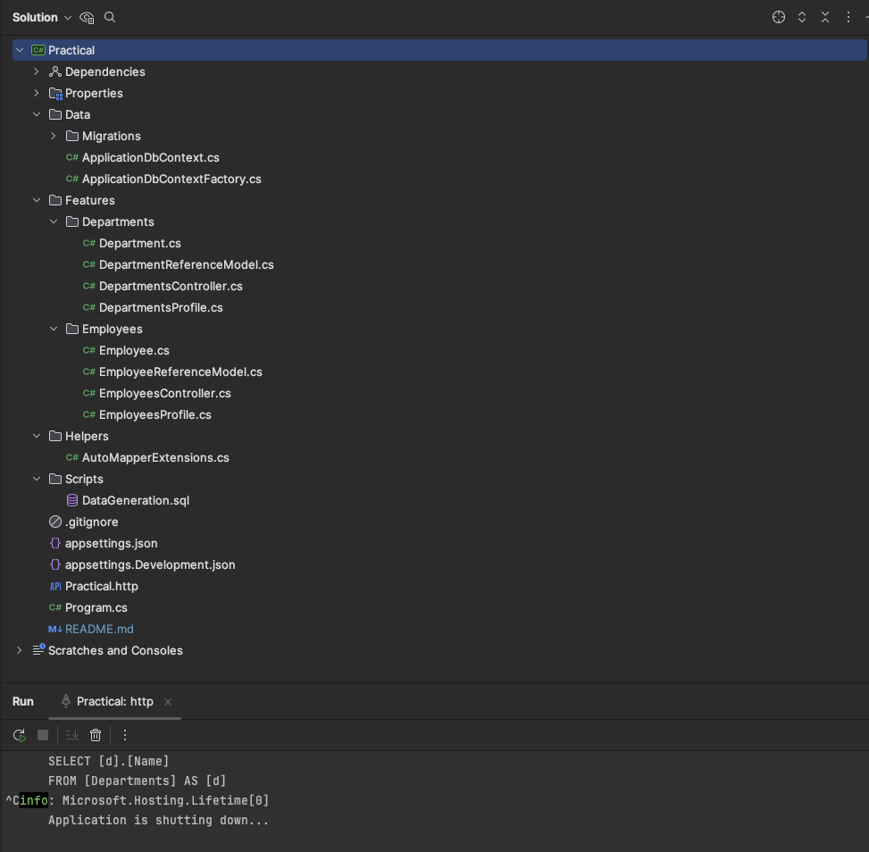
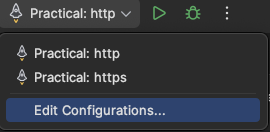
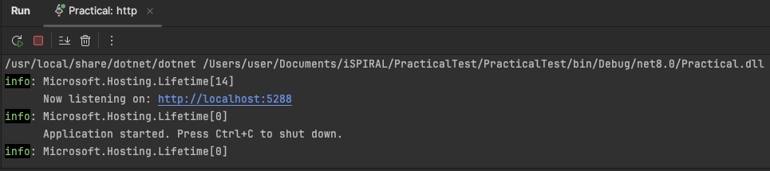
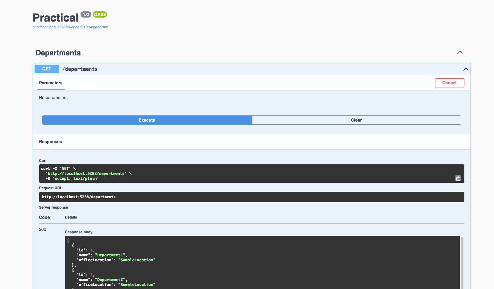
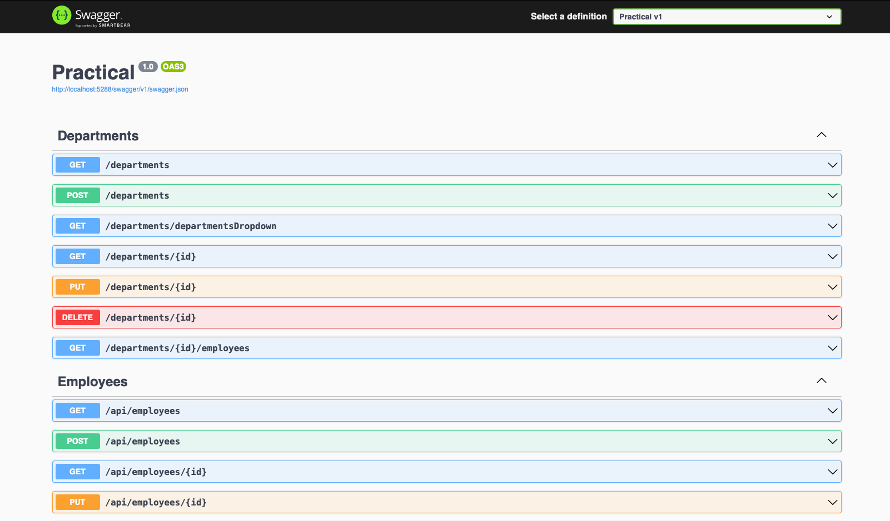

# PracticalTest

this project was created using .Net 8.0

The project contains WEB APIs to make CRUD operations for Employees and Departments.
Each employee belongs to one department

Additional to the CRUD operations the WEB APIs offers the following:
 
-  Retrieve all employees belonging to a department based on Department ID.
-  Retrieve the top N employees (N is given) with Highest Salary.
-  Retrieve the average salary of employees in a specific department, return the departmentId and the average salary.
-  Retrieve employees whose salaries fall within a specified range.

***

# The Set-Up 

For this Scenario I am using Rider as the preferred IDE.
You can use any IDE you want. Also, I am using Microsoft SQL server running on docker container


You need to have .Net 8.0 runtime to be able to run it  or .Net SDK to be able to 
make changes in the code and also run it. For more info use this link: https://dotnet.microsoft.com/en-us/


- After cloning the project locally open the .sln file in your preferred IDE


- In Rider under solution explorer: in Practical, right click, tools -> .NET user Secrets



In this file we need to specify the connection string for teh database. The final file should be like this:


```bash
{ 
  "ConnectionStrings:DefaultConnection": "User Id=SA;Password=Password1234;Server=localhost;Database=PracticalDB;Encrypt=False;"
}
```

# Database 

You can open a terminal in a new separate window or using the IDE and navigate to the project root folder using `cd` commands

Once you are in the root of the project you run the following command:

bash
```
dotnet ef database update
```

If you have correctly added the connection string the database should be created automatically


# Add Data to the Database (Optional)

In case you want to add some dummy data to the database and see how works I made a simple SQL file that cou can find under `Scripts/DataGeneration.sql`.
You can run this sql file in you preferred Management application (SSMS, Azure Data Studio) and automatically will generate a few data for Departments and Employees.

# Rider

Make sure that the run/debug widget `top/right` (assuming default UI layout)
is populated with 3 options:

* `Practical: http`
* `Practical: https`



# Running the project

Open the run/debug widget dropdown, click **run** `Practical:http`. It will be running on its own and automatically will open a browser showing the Swagger UI.

** In case the browser does not open automatically you can navigate under http://localhost:`{The port soecified under run tap in the IDE}`



# Using the Project

You can navigate and see all the available functions and run them using the Swagger UI in browser. The results are usually in a json format



