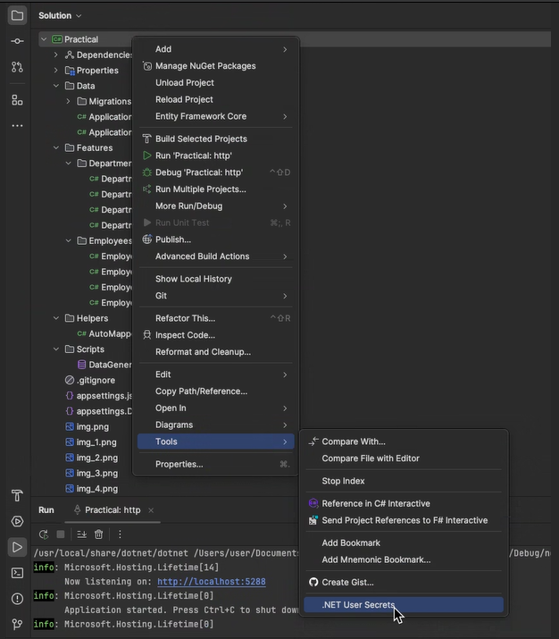

# PracticalTest

This project is built with **.NET 8.0** and provides a set of RESTful Web APIs for managing **Employees** and **Departments**.

Each employee is associated with one department.

---

## Features

In addition to full CRUD support for employees and departments, the API provides:

- Get all employees in a specific department
- Get the **Top N** employees with the highest salary (`top` is user-defined)
- Get the **average salary** of employees in a department (returns department ID and average)
- Get all employees whose **salaries are within a specified range**

---

# The Set-Up Instructions

> **IDE Used:** Rider (but any .NET capable IDE works such as Visual Studio, VS Code)

> **Database:** Microsoft SQL Server

### Requirements

- [.NET 8 SDK](https://dotnet.microsoft.com/en-us/download/dotnet/8.0)
- SQL Server (LocalDB, Docker, or full instance)
- EF Core CLI (`dotnet ef` installed globally)

---
- After cloning the project locally open the .sln file in your preferred IDE


- In Rider under solution explorer: in Practical, right click, tools -> .NET user Secrets



In this file we need to specify the connection string for teh database. The final file should be like this:


```bash
{ 
  "ConnectionStrings:DefaultConnection": "User Id=SA;Password=Password1234;Server=localhost;Database=PracticalDB;Encrypt=False;"
}
```

Alternatively you can use user secrets CLI 
```bash
dotnet user-secrets init
dotnet user-secrets set   "ConnectionStrings:DefaultConnection": "User Id=SA;Password=Password1234;Server=localhost;Database=PracticalDB;Encrypt=False;"

```

** You can replace the Database name and Database connection method to fit your application. For example in `windows` you have windows auth and the connection string can be motified like this:

```bash
{
  "ConnectionStrings:DefaultConnection": "Server=localhost;Database=PracticalDB;Trusted_Connection=True;Encrypt=False;"
}
```

# Populate the Database 

You can open a terminal in a new separate window or using the IDE and navigate to the project root folder using `cd` commands

Once you are in the root of the project you run the following command:

``` bash
dotnet ef database update
```

If you have correctly added the connection string the database should be created automatically


# Add Data to the Database (Optional)

In case you want to add some dummy data to the database and see how works I made a simple SQL file that you can find under `Scripts/DataGeneration.sql`.
You can run this sql file in you preferred Management application (SSMS, Azure Data Studio) and automatically will generate a few data for Departments and Employees.

# Rider

Make sure that the run/debug widget `top/right` (assuming default UI layout)
is populated with 2 options:

* `Practical: http`
* `Practical: https`


# Running the project

Open the run/debug widget dropdown, click **run** `Practical:http`. It will be running on its own and automatically will open a browser showing the Swagger UI.

** In case the browser does not open automatically you can navigate under http://localhost: `{The port specified under run tap in the IDE}`


Alternatively, you can just type the following command on terminal (under root directory) to run it and use ^C to terminate

```bash
dotnet run
```


# Using the Project

You can navigate and see all the available functions and run them using the Swagger UI in browser. The results are usually in a json format


